# Smart Home IoT — Sistema Concorrente com Sockets TCP em Python

> Sockets TCP, Concorrência Multithread e Protocolos de Aplicação

<p align="center">
  <a href="doc/assets/prints/print7_teste_no_tmux.png" target="_blank" title="Clique para abrir e inspecionar em alta resolução (3398 × 1387)">
    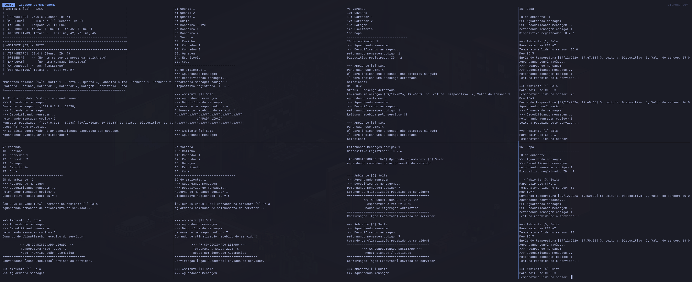
  </a>
</p>

<p align="center">
  <em><b>Demonstração Panorâmica:</b> Servidor com Monitor ASCII (painel superior esquerdo) gerenciando simultaneamente 7 nós clientes (lâmpadas, presença, termômetros e ar-condicionado) distribuídos em painéis simultâneos do <code>tmux</code> em monitor ultrawide.</em>
  <br>
  <sub>🔍 <b>Visualização em Alta Definição:</b> Clique na imagem para expandir ou utilize os links abaixo para inspecionar cada painel em detalhes:</sub>
  <br>
  <a href="doc/assets/prints/print7_teste_no_tmux.png" target="_blank"><b>[ 🔍 Abrir Imagem em Alta Resolução (3398 × 1387) ]</b></a> &nbsp;•&nbsp;
  <a href="doc/assets/prints/print7_teste_no_tmux.png" download="print7_teste_no_tmux.png"><b>[ ⬇️ Baixar Arquivo Original (PNG) ]</b></a>
</p>

---

## Sumário
- [1. Fundamentos de Sockets TCP](#1-fundamentos-de-sockets-tcp)
  - [1.1. O que são Sockets de Rede](#11-o-que-são-sockets-de-rede)
  - [1.2. O Modelo Stream TCP (`SOCK_STREAM`) vs Datagramas UDP (`SOCK_DGRAM`)](#12-o-modelo-stream-tcp-sock_stream-vs-datagramas-udp-sock_dgram)
  - [1.3. O Funcionamento dos Buffers TCP e a Falácia de "1 send() = 1 recv()"](#13-o-funcionamento-dos-buffers-tcp-e-a-falácia-de-1-send--1-recv)
  - [1.4. O Problema do Framing e Como a Aplicação Trata o Recebimento](#14-o-problema-do-framing-e-como-a-aplicação-trata-o-recebimento)
- [2. Arquitetura e Diagramas de Fluxo](#2-arquitetura-e-diagramas-de-fluxo)
  - [2.1. Visão Geral da Arquitetura Multithread](#21-visão-geral-da-arquitetura-multithread)
  - [2.2. Diagrama 1: Arquitetura Geral de Threads e Filas](#22-diagrama-1-arquitetura-geral-de-threads-e-filas)
  - [2.3. Diagrama 2: Fluxo do Cliente Termômetro](#23-diagrama-2-fluxo-do-cliente-termômetro)
  - [2.4. Diagrama 3: Fluxo do Sensor de Presença](#24-diagrama-3-fluxo-do-sensor-de-presença)
  - [2.5. Diagrama 4: Fluxo dos Atuadores (Lâmpada e Ar-Condicionado)](#25-diagrama-4-fluxo-dos-atuadores-lâmpada-e-ar-condicionado)
  - [2.6. Diagrama 5: Handshake e Registro de Dispositivos](#26-diagrama-5-handshake-e-registro-de-dispositivos)
  - [2.7. O Monitor Residencial em ASCII em Tempo Real](#27-o-monitor-residencial-em-ascii-em-tempo-real)
- [3. O Protocolo de Comunicação](#3-o-protocolo-de-comunicação)
  - [3.1. Design Binário sobre TCP (`struct`)](#31-design-binário-sobre-tcp-struct)
  - [3.2. Estrutura dos Pacotes e Convenção de Rede (*Big-Endian*)](#32-estrutura-dos-pacotes-e-convenção-de-rede-big-endian)
  - [3.3. Tabela Completa das Mensagens do Protocolo](#33-tabela-completa-das-mensagens-do-protocolo)
  - [3.4. Detalhamento Campo a Campo de Cada Mensagem](#34-detalhamento-campo-a-campo-de-cada-mensagem)
- [4. Extensão do Sistema e Melhorias do Legado](#4-extensão-do-sistema-e-melhorias-do-legado)
  - [4.1. Novo Cliente: Ar-Condicionado Inteligente (`Cliente_ArCondicionado.py`)](#41-novo-cliente-ar-condicionado-inteligente-cliente_arcondicionadopy)
  - [4.2. Automação Térmica Integrada (Termômetro $\rightarrow$ Ar-Condicionado)](#42-automação-térmica-integrada-termômetro--ar-condicionado)
  - [4.3. Monitor Residencial em Tempo Real (`Monitor.py`)](#43-monitor-residencial-em-tempo-real-monitorpy)
  - [4.4. Bugs Corrigidos e Dívidas Técnicas Solucionadas](#44-bugs-corrigidos-e-dívidas-técnicas-solucionadas)
- [5. Roteiro Detalhado de Testes](#5-roteiro-detalhado-de-testes)
  - [5.1. Como Inicializar e Executar](#51-como-inicializar-e-executar)
  - [5.2. Cenário 1: Inicialização do Servidor](#52-cenário-1-inicialização-do-servidor)
  - [5.3. Cenário 2: Teste Obrigatório de Erro (Dispositivo Não Suportado)](#53-cenário-2-teste-obrigatório-de-erro-dispositivo-não-suportado)
  - [5.4. Cenário 3: Registro de Dispositivos e Ambientes](#54-cenário-3-registro-de-dispositivos-e-ambientes)
  - [5.5. Cenário 4: Atuação Integrada Presença $\rightarrow$ Lâmpada](#55-cenário-4-atuação-integrada-presença--lâmpada)
  - [5.6. Cenário 5: Automação Térmica Termômetro $\rightarrow$ Ar-Condicionado](#56-cenário-5-automação-térmica-termômetro--ar-condicionado)
  - [5.7. Cenário 6: Resfriamento e Desligamento Automático](#57-cenário-6-resfriamento-e-desligamento-automático)
  - [5.8. Cenário 7: Visão Panorâmica Multitasking em Terminal Ultrawide (`tmux`)](#58-cenário-7-visão-panorâmica-multitasking-em-terminal-ultrawide-tmux)

---

# 1. Fundamentos de Sockets TCP

### 1.1. O que são Sockets de Rede
Um **Socket** é a abstração fundamental da API de rede do sistema operacional (originada nos *Berkeley Sockets* do BSD UNIX).
O Python inclusive utiliza a nomenclatura original em sua biblioteca (ex: IP como socket.AF_INET e TCP como socket.SOCK_STREAM). Sua função
é atuar como um ponto final (*endpoint*) bidirecional para comunicação entre processos (IPC - *Inter-Process Communication*),
seja na mesma máquina local ou através de uma rede IP como a Internet. Supondo a aplicação como uma casa, o socket é como se fosse a porta
da residência, onde a aplicação passa os bits pela porta e espera que ele encontre a outra aplicação que quer se comunicar do outro lado
abstraindo a complexidade do processo.

Na pilha TCP/IP, uma conexão estabelecida é univocamente definida pela **tupla de 5 elementos**:
$$\text{Conexão} = \langle \text{IP Origem}, \text{Porta Origem}, \text{IP Destino}, \text{Porta Destino}, \text{Protocolo (TCP)} \rangle$$

Em Python, a criação de sockets TCP utiliza a biblioteca padrão `socket`:
```python
tcp = socket.socket(socket.AF_INET, socket.SOCK_STREAM)
```
* `socket.AF_INET`: Família de endereçamento IPv4 (32 bits).
* `socket.SOCK_STREAM`: Tipo de socket que seleciona o protocolo de transporte **TCP** (*Transmission Control Protocol*).

---

### 1.2. O Modelo Stream TCP (`SOCK_STREAM`) vs Datagramas UDP (`SOCK_DGRAM`)

A distinção conceitual mais importante em programação de rede é a diferença entre **transporte orientado a fluxo contínuo de bytes (*Stream*)** e **transporte orientado a datagramas/mensagens (*Datagram*)**:

| Característica | TCP (`SOCK_STREAM`) | UDP (`SOCK_DGRAM`) |
| :--- | :--- | :--- |
| **Conexão** | Orientado a conexão (*Three-Way Handshake* prévio) | Não orientado a conexão (*Connectionless*) |
| **Fronteiras de Mensagem (*Boundaries*)** | **Não possui**. O TCP enxerga apenas um fluxo contínuo de bytes sem início ou fim definidos no nível de transporte. | **Possui**. Cada `sendto()` gera um datagrama atômico isolado entregue em um único `recvfrom()`. |
| **Confiabilidade** | Garantida: retransmissão de pacotes perdidos via ACKs e timeouts. | Não garantida (*Best-effort*): pacotes podem sumir ou chegar duplicados. |
| **Ordem de Entrega** | Rigorosamente sequencial (garantida por números de sequência). | Sem garantia de ordem (pacotes podem chegar fora de ordem). |
| **Controle de Fluxo/Congestionamento** | Sim (Janela Deslizante, *Slow Start*, *Congestion Avoidance*). | Não. A aplicação transmite na velocidade que desejar. |

Cabe aqui também uma observação, seguindo as orientações do Dr. James F. Kurose usamos a nomenclatura clássica do UDP como datagrama com o entendimento que
geralmente o nome datagrama é usado pela camada de rede.

---

### 1.3. O Funcionamento dos Buffers TCP e a Falácia de "1 send() = 1 recv()"

Um dos erros conceituais mais comuns em redes é acreditar na seguinte premissa:

$$\text{Cliente chama } send(msg) \implies \text{Servidor recebe exatamente } recv() = msg \quad \textbf{(FALSO!)}$$

#### Por que isso não é verdade?
O TCP é um protocolo de **fluxo contínuo (*byte stream*)**. Quando uma aplicação executa `connection.send(dados)`, os dados **não vão diretamente para a placa de rede nem para o destinatário imediatamente**. Eles são copiados para a **Fila de Envio do Kernel (*Socket Send Buffer*)**.

Do outro lado, a placa de rede do receptor recebe os segmentos IP, o kernel processa os números de sequência, confirma o recebimento (ACK) e deposita os bytes na **Fila de Recepção do Kernel (*Socket Receive Buffer*)**. Quando o código chama `connection.recv(TAM_BUFFER)`, ele apenas retira do buffer do kernel os bytes que estiverem disponíveis naquele instante (até o limite de `TAM_BUFFER`).

```
[Aplicação Emissora]                 [Aplicação Receptora]
        │                                      ▲
   send(dados)                            recv(buffer)
        ▼                                      │
┌──────────────────┐                  ┌──────────────────┐
│ Send Buffer (OS) │                  │ Recv Buffer (OS) │
└─────────┬────────┘                  └────────▲─────────┘
          │        Segmentos TCP (IP)          │
          └────────────────────────────────────┘
```

Três fatores físicos da rede quebram o mapeamento 1:1 entre `send()` e `recv()`:

1. **Fragmentação de Pacotes (*Message Splitting*)**:
   Se uma aplicação emissora enviar uma mensagem de 1024 bytes, o sistema operacional ou os roteadores intermediários podem segmentar o fluxo em dois pacotes (ex: 700 bytes e 324 bytes) devido ao MTU (*Maximum Transmission Unit*) da interface. O `recv(1024)` do receptor retornará primeiro apenas 700 bytes. Se o receptor esperar a mensagem inteira em uma única chamada, receberá dados incompletos e quebrará a decodificação.
2. **Coalescência de Mensagens (*Message Glomming / Sticky Packets*)**:
   Se o emissor fizer dois `send()` consecutivos rápidos (ex: Mensagem A de 15 bytes e Mensagem B de 10 bytes), o **Algoritmo de Nagle** do TCP agrupará ambos os envios no mesmo segmento TCP para economizar cabeçalhos de rede. No outro lado, uma única chamada `recv(1024)` retornará **25 bytes juntos contendo as duas mensagens coladas**.
3. **Descompasso de Leitura**:
   A aplicação receptora pode demorar a processar, fazendo com que 5 mensagens consecutivas se acumulem na fila do sistema operacional, sendo lidas de uma só vez em um único `recv()`.

---

### 1.4. O Problema do Framing e Como a Aplicação Trata o Recebimento

Como o TCP não preserva os limites das mensagens, a **Camada de Aplicação é 100\% responsável por implementar o delimitador (*Framing*)**.

Existem três abordagens clássicas para resolver o *Framing*:
1. **Delimitadores de caractere especial** (ex: terminar cada mensagem com `\n` ou `\0` — comum em protocolos texto como HTTP e SMTP).
2. **Prefixação de tamanho fixo (*Length-Prefix*)** (ex: os primeiros 2 ou 4 bytes indicam quantos bytes de carga útil se seguem).
3. **Mensagens com cabeçalho de tamanho determinístico** (utilizada neste projeto).

#### A Solução Implementada em [`src/Message.py`](src/Message.py):
No sistema é implementado um **Acumulador de Buffer na Aplicação** acoplado a um **Decodificador Fixo de Cabeçalho**:

```python
# Trecho de ReceiveMessage em src/Message.py:
def ReceiveMessage(connection, device):
    msg = None
    if not device.buffer or len(device.buffer) == 0:
        device.buffer = connection.recv(TAM_BUFFER)
    while True:
        if device.buffer and len(device.buffer) > 0:
            msg, device.buffer = getMessage(device.buffer)
        if msg != None:
            return msg
        # Se a mensagem estava incompleta, busca mais bytes no socket e CONCATENA
        dataBin = connection.recv(TAM_BUFFER)
        if not dataBin:
            connection.close()
            break
        device.buffer = device.buffer + dataBin
    return None
```

```
Fluxo do Framing no Buffer da Aplicação:
1. Chega pacote parcial (7 bytes)   -> buffer = [ 7 bytes ] -> getMessage() retorna None
2. recv() recebe o restante         -> buffer = [ 7 bytes ] + [ 8 bytes ] = [ 15 bytes ]
3. getMessage() identifica código   -> extrai mensagem de 15 bytes e fatia: buffer = buffer[15:]
4. Retorna objeto decodificado completo e preserva o restante do buffer para a próxima mensagem!
```

Na função `getMessage(buffer)`:
* O primeiro byte (`buffer[:1]`) é lido como `unsigned char` (`!B`). Ele informa o código da mensagem (`1` a `7`).
* A partir do código, o sistema consulta a tabela `msgsSize = [15, 10, 11, 11, 17, 14, 18]` para saber exatamente quantos bytes aquela mensagem ocupa.
* Se `len(buffer) < msgSize`, a função retorna `None`, sinalizando ao `ReceiveMessage` para continuar acumulando bytes do socket.
* Se `len(buffer) >= msgSize`, a mensagem é fatiada com `buffer[:msgSize]`, removida do buffer com `buffer = buffer[msgSize:]` e desempacotada via `struct.unpack()`.

---

# 2. Arquitetura e Diagramas de Fluxo

### 2.1. Visão Geral da Arquitetura Multithread

O sistema adota uma arquitetura baseada no **Padrão Mediador (*Mediator Pattern*) com Filas Thread-Safe (`queue.Queue`)**. A aplicação é dividida em quatro componentes fundamentais:

1. **Thread Principal do Servidor ([`Server.py`](src/Server.py))**:
   * Responsável por inicializar o socket passivo em `bind((SERVIDOR, PORTA))` e `listen()`.
   * Inicializa e dispara a thread singleton de controle geral (`GeneralControl`).
   * Executa o loop bloqueante `accept()`. A cada novo cliente que se conecta, instancia um objeto `Device` e dispara uma nova thread independente `DeviceThread` para atendê-lo.
2. **Threads Individuais dos Dispositivos ([`DeviceThread.py`](src/DeviceThread.py))**:
   * Uma thread dedicada para cada conexão ativa de socket.
   * Executa a máquina de estados finitos do dispositivo (`SM_INICIALIZANDO` $\rightarrow$ `SM_SELECIONA_AMBIENTE` $\rightarrow$ `SM_CONECTADO_*`).
   * Isola falhas: se um cliente cair ou enviar dados corrompidos, apenas a sua respectiva `DeviceThread` encerra, mantendo todo o restante da residência intacto.
3. **Thread de Controle Geral ([`GeneralControl.py`](src/GeneralControl.py))**:
   * Núcleo de inteligência e sincronização de estado global da casa.
   * Consome de forma concorrente a fila central `controlQueue = queue.Queue()`.
   * Como apenas a thread `GeneralControl` altera os estados e coleções dos cômodos (`RoomItem`), **elimina-se a necessidade de travas complexas (*locks*) entre clientes**, prevenindo *race conditions* e *deadlocks*.
   * Aplica as regras de automação residencial (ex: presença acende lâmpada; temperatura acima de 24°C liga o ar-condicionado).
4. **Monitor Residencial ASCII ([`Monitor.py`](src/Monitor.py))**:
   * Módulo de exibição em tempo real invocado a cada transição de estado da residência.

> [!TIP]
> **Tema Visual **:
> Os diagramas foram projetados com estilização inspirada no jogo Cyberpunk2077 para aumentar sua beleza (fundo marinho escuro, brilho neon ciano e alto contraste). O arquivo de tema está centralizado em [`doc/assets/themes/cyberpunk.css`](doc/assets/themes/cyberpunk.css) e a automação de compilação em [`tools/`](tools/). Para recompilar todos os diagramas em SVG e PNG Retina 2x, basta executar `./tools/build_diagrams.sh`.

---

### 2.2. Diagrama 1: Arquitetura Geral de Threads e Filas

O diagrama abaixo detalha a topologia de concorrência do sistema, mostrando como as threads dos clientes alimentam a fila central e como os atuadores recebem comandos por suas filas dedicadas:

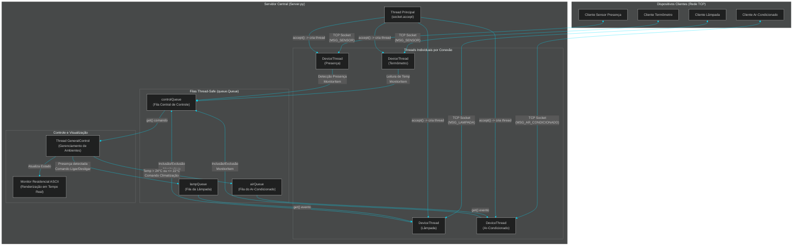

*Versão gráfica vetorial:* [SVG](doc/assets/diagrams/diagrama1_arquitetura_threads.svg) | [PNG](doc/assets/diagrams/diagrama1_arquitetura_threads.png)

---

### 2.3. Diagrama 2: Fluxo do Cliente Termômetro

Mostra o envio de leitura térmica pelo sensor, a confirmação do servidor e o gatilho da automação climática:

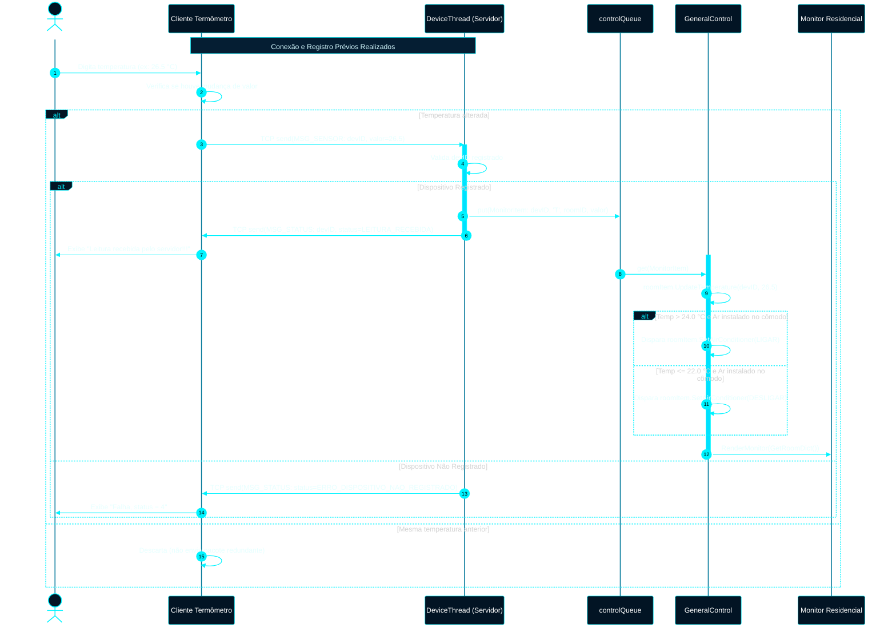

*Versão gráfica vetorial:* [SVG](doc/assets/diagrams/diagrama2_cliente_temperatura.svg) | [PNG](doc/assets/diagrams/diagrama2_cliente_temperatura.png)

---

### 2.4. Diagrama 3: Fluxo do Sensor de Presença

Ilustra como a leitura de presença é repassada ao mediador central para acender ou apagar as lâmpadas do ambiente:

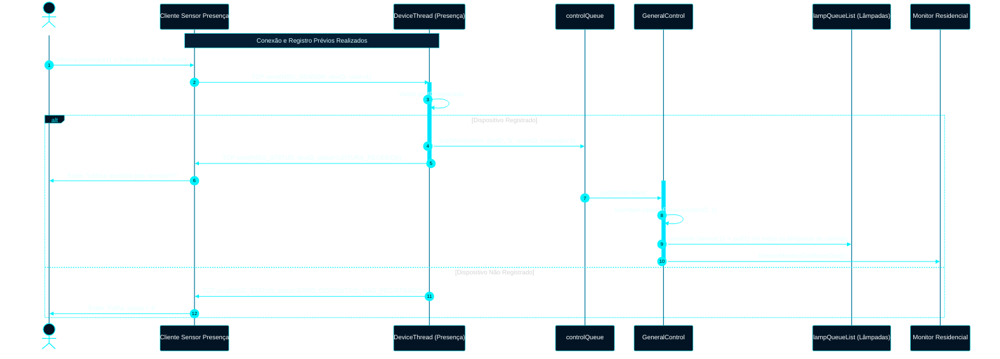

*Versão gráfica vetorial:* [SVG](doc/assets/diagrams/diagrama3_cliente_presenca.svg) | [PNG](doc/assets/diagrams/diagrama3_cliente_presenca.png)

---

### 2.5. Diagrama 4: Fluxo dos Atuadores (Lâmpada e Ar-Condicionado)

Exibe o ciclo reativo de espera nas filas dedicadas e a confirmação de execução de ordens físicas:

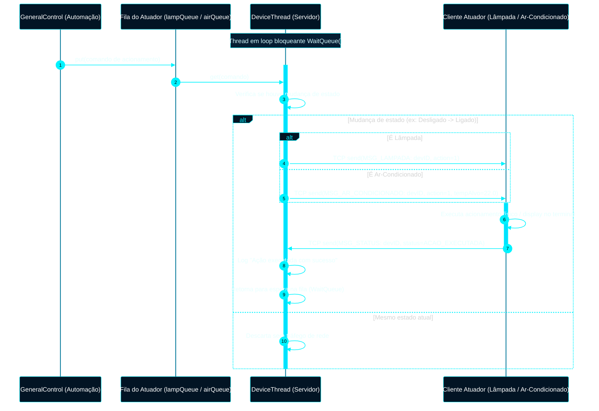

*Versão gráfica vetorial:* [SVG](doc/assets/diagrams/diagrama4_cliente_atuadores.svg) | [PNG](doc/assets/diagrams/diagrama4_cliente_atuadores.png)

---

### 2.6. Diagrama 5: Handshake e Registro de Dispositivos

Apresenta o fluxo de validação de tipo, entrega do catálogo de ambientes, geração atômica de ID e ramificação da máquina de estados:

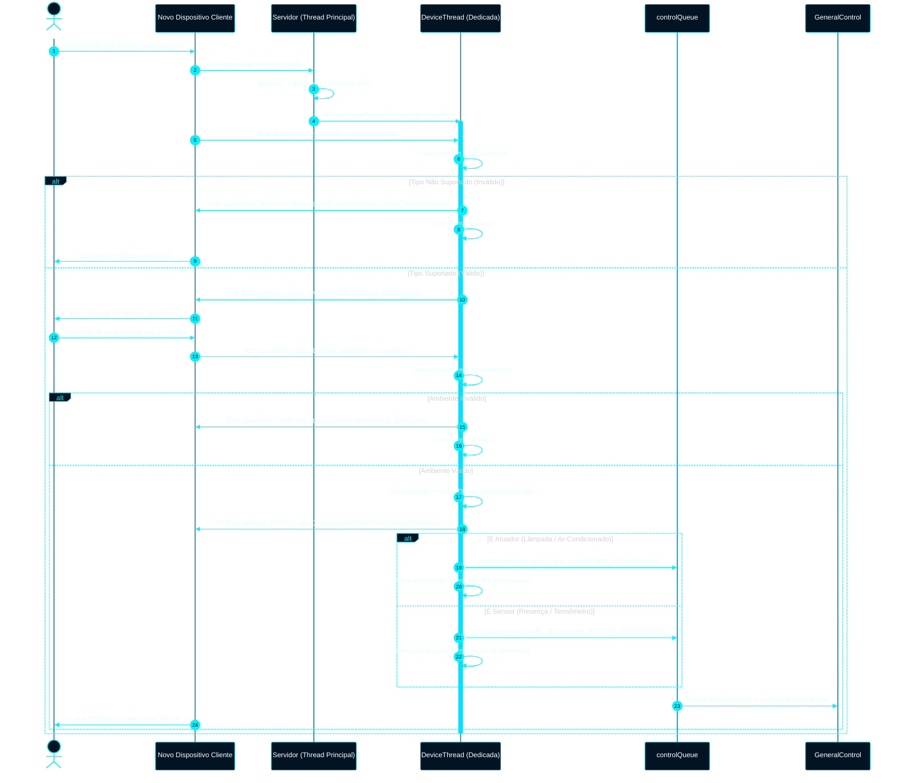

*Versão gráfica vetorial:* [SVG](doc/assets/diagrams/diagrama5_handshake_registro.svg) | [PNG](doc/assets/diagrams/diagrama5_handshake_registro.png)

---

### 2.7. O Monitor Residencial em ASCII em Tempo Real

Para transformar a entrega em uma ferramenta didática e auditável, foi desenvolvido o módulo [`src/Monitor.py`](src/Monitor.py) no servidor.
Foi a primeira mudança que foi feita no código original. Parti do princípio que começar fazendo uma melhoria no servidor para visualizar melhor
como o sistema funcionava e as variáveis envolvidas seria o melhor caminho, sendo análogo a tela do servidor onde é possivel ver os ambientes,
os dispositivos e o estado dos mesmos.

* **Alinhamento de 68 colunas**: feito pela função `_box_line()`, mantendo as bordas verticais `|` alinhadas independentemente do tamanho dos textos.
* **Sem Códigos Destrutivos de Tela**: Não executa `cls` ou `clear`. Cada novo evento imprime um novo quadro cronológico (cospe um cartão ascii a cada evento), preservando o histórico de comandos no terminal.
* **Foco em Ambientes Ativos**: Renderiza cartões detalhados apenas dos cômodos com sensores ou atuadores instalados, listando os demais de forma resumida no rodapé:

```text
+==================================================================+
| MONITOR RESIDENCIAL - SMART HOME                                 |
| Status em tempo real | 12/09/2026, 17:18:10                      |
+==================================================================+
| ULTIMO EVENTO: Temp 26.5 °C | [AUTOMAÇÃO] Ar-Condicionado LIGADO |
+------------------------------------------------------------------+
+------------------------------------------------------------------+
| AMBIENTE [01] - SALA                                             |
+------------------------------------------------------------------+
| [TERMOMETRO]  26.5 C (Sensor ID: 3)                              |
| [PRESENCA]    DETECTADA [!] (Sensor ID: 2)                       |
| [LAMPADAS]    Lampada #1: [ACESA]                                |
| [AR-CONDIC.]  Ar #4: [LIGADO]                                    |
| [DISPOSITIVOS] Total: 4 | IDs: #1, #2, #3, #4                    |
+------------------------------------------------------------------+

Ambientes ociosos (14): Quarto 1, Quarto 2, Quarto 3, Suite, Varanda...
+==================================================================+
```

---

# 3. O Protocolo de Comunicação

### 3.1. Design Binário sobre TCP (`struct`)
Ao contrário de arquiteturas web convencionais que utilizam protocolos baseados em texto (como JSON, XML ou HTTP) com alto overhead de parsing e tamanho, este projeto adota um **Protocolo de Aplicação Binário Estrito**.

Vantagens do protocolo binário em IoT residencial:
1. **Compacidade Extrema**: Um comando de acionamento completo ocupa apenas **14 bytes** (Lâmpada) ou **18 bytes** (Ar-Condicionado).
2. **Eficiência de CPU**: Não exige parsers de strings; os valores são lidos e mapeados diretamente para registradores numéricos da CPU via `struct.unpack()`.
3. **Determinismo**: Cada campo possui tamanho em bytes fixo e offset imutável.
4. **É interessante para o aprendizado, você consegue empacotar um objeto python e desempacotar do outro lado, e tem a noção de que o que está trafegando são zeros e uns. E o trabalho sujo de juntar os bytes e depois fatia-los do outro lado é todo seu**

---

### 3.2. Estrutura dos Pacotes e Convenção de Rede (*Big-Endian*)

O protocolo utiliza a biblioteca `struct` do Python com prefixo **`!`**, indicando **ordem de bytes de rede (*Network Byte Order / Big-Endian*)**. Isso garante que nós com arquiteturas distintas (*Little-Endian* x86 e *Big-Endian* ARM/MIPS) decodifiquem inteiros e pontos flutuantes de maneira idêntica.

Tipos primitivos utilizados no protocolo:
* `B`: `unsigned char` (1 byte, valor de `0` a `255`).
* `H`: `unsigned short` (2 bytes, valor de `0` a `65.535`).
* `I`: `unsigned int` (4 bytes, valor de `0` a `4.294.967.295`).
* `f`: `float` IEEE 754 (4 bytes, precisão simples), usado na temperatura.
* `d`: `double` IEEE 754 (8 bytes, precisão dupla, usado para Timestamp Unix com microsegundos).

---

### 3.3. Tabela das Mensagens do Protocolo

| Código | Nome da Mensagem | Máscara `struct` | Tamanho (Bytes) | Direção | Finalidade |
| :---: | :--- | :---: | :---: | :---: | :--- |
| **`1`** | `MSG_STATUS` | `!BdIH` | **15 bytes** | Bidirecional | Envio de código de status/confirmação ou erro. |
| **`2`** | `MSG_REGISTRO` | `!BdB` | **10 bytes** | Cliente $\rightarrow$ Servidor | Solicitação de registro informando o tipo de dispositivo. |
| **`3`** | `MSG_LISTA_AMBIENTES` | `!BdH` + $N \times 22$ | Variável ($11 + 22N$) | Servidor $\rightarrow$ Cliente | Catálogo de ambientes cadastrados na residência. |
| **`4`** | `MSG_SELECIONA_AMBIENTE` | `!BdH` | **11 bytes** | Cliente $\rightarrow$ Servidor | Seleção do ambiente onde o dispositivo operará. |
| **`5`** | `MSG_SENSOR` | `!BdIf` | **17 bytes** | Cliente $\rightarrow$ Servidor | Telemetria do sensor (float para temperatura, 0/1 para presença). |
| **`6`** | `MSG_LAMPADA` | `!BdIB` | **14 bytes** | Servidor $\rightarrow$ Cliente | Comando de ligar (`1`) ou desligar (`0`) lâmpada. |
| **`7`** | `MSG_AR_CONDICIONADO` | `!BdIBf` | **18 bytes** | Servidor $\rightarrow$ Cliente | Comando de climatização (ação 0/1 e temperatura alvo em float). |

---

### 3.4. Detalhamento Campo a Campo de Cada Mensagem

#### 1. `MSG_STATUS` (Código 1) — 15 Bytes
```
 0       1               9              13      15 (bytes)
┌───────┬───────────────┬───────────────┬───────┐
│ Code  │ Timestamp     │ DeviceID      │ Status│
│ (1 B) │ (8 B, double) │ (4 B, uint32) │ (2 B) │
└───────┴───────────────┴───────────────┴───────┘
```
* **Códigos de Status**:
  * `1`: Dispositivo registrado
  * `2`: Leitura recebida
  * `3`: Ação executada
  * `4`: Dispositivo ainda não registrado
  * `5`: Tipo de dispositivo não suportado
  * `6`: Formato de mensagem inválida
  * `7`: Ambiente selecionado inválido
  * `8`: ID de dispositivo inválido
  * `9`: Ação não suportada
  * `10`: Mensagem não esperada
  * `11`: Falha de comunicação

#### 2. `MSG_REGISTRO` (Código 2) — 10 Bytes
```
 0       1               9  10 (bytes)
┌───────┬───────────────┬───┐
│ Code  │ Timestamp     │Typ│
│ (1 B) │ (8 B, double) │1 B│
└───────┴───────────────┴───┘
```
* `Typ`: `1` (Lâmpada), `2` (Presença), `3` (Termômetro), `4` (Ar-Condicionado).

#### 3. `MSG_LISTA_AMBIENTES` (Código 3) — $11 + N \times 22$ Bytes
* Cabeçalho de 11 bytes: `Code (1B)` + `Timestamp (8B)` + `Quantidade de Ambientes (2B, uint16)`.
* Cada ambiente ocupa exatamente **22 bytes**: `RoomID (2B, uint16)` + `RoomName (20B, string codificada em UTF-8 com preenchimento em nulos)`.

#### 4. `MSG_SELECIONA_AMBIENTE` (Código 4) — 11 Bytes
* `Code (1B)` + `Timestamp (8B)` + `RoomID (2B, uint16)`.

#### 5. `MSG_SENSOR` (Código 5) — 17 Bytes
```
 0       1               9              13     17 (bytes)
┌───────┬───────────────┬───────────────┬───────┐
│ Code  │ Timestamp     │ DeviceID      │ Valor │
│ (1 B) │ (8 B, double) │ (4 B, uint32) │(4B,flt│
└───────┴───────────────┴───────────────┴───────┘
```
* `Valor`: Para presença, `0.0` (ausência) ou `1.0` (detectada). Para termômetro, temperatura real lida em graus Celsius (ex: `26.5`).

#### 6. `MSG_LAMPADA` (Código 6) — 14 Bytes
* `Code (1B)` + `Timestamp (8B)` + `DeviceID (4B, uint32)` + `Action (1B)` (`0` = Apagar, `1` = Acender).

#### 7. `MSG_AR_CONDICIONADO` (Código 7) — 18 Bytes
```
 0       1               9              13   14        18 (bytes)
┌───────┬───────────────┬───────────────┬────┬─────────┐
│ Code  │ Timestamp     │ DeviceID      │Act │Temp Alvo│
│ (1 B) │ (8 B, double) │ (4 B, uint32) │1 B │(4B, flt)│
└───────┴───────────────┴───────────────┴────┴─────────┘
```
* `Act`: `0` (`AR_DESLIGADO`), `1` (`AR_LIGADO`).
* `Temp Alvo`: Float de 4 bytes definindo o setpoint desejado (ex: `22.0`).

---

# 4. Extensão do Sistema e Melhorias em Relação ao Original

### 4.1. Novo Cliente: Ar-Condicionado Inteligente (`Cliente_ArCondicionado.py`)
Conforme solicitado no Passo 3 da atividade, foi implementado um novo dispositivo para o smarthome: o **Ar-Condicionado**.
* Cadastrado em [`src/dispositivos.txt`](src/dispositivos.txt) como `4,A,Ar-Condicionado`.
* Comunica-se por meio da mensagem binária dedicada de 18 bytes `MSG_AR_CONDICIONADO`.
* Mantém interface textual no console com molduras de status e confirmação automática de ordens.

### 4.2. Automação Térmica Integrada (Termômetro $\rightarrow$ Ar-Condicionado)
Diferente de um atuador passivo isolado, o Ar-Condicionado opera integrado com o **Termômetro** do mesmo cômodo com **histerese térmica**:
* Se o Termômetro enviar temperatura $T > 24.0^\circ\text{C}$: o servidor despacha automaticamente ordem para **Ligar o Ar-Condicionado** na temperatura alvo de $22.0^\circ\text{C}$.
* Se o Termômetro enviar temperatura $T \le 22.0^\circ\text{C}$: o servidor despacha ordem para **Desligar o Ar-Condicionado** (standby).
* A histerese evita comutação excessiva (desgaste de relé/compressor) em oscilações mínimas.

### 4.3. Monitor Residencial em Tempo Real (`Monitor.py`)
O sistema legado possuía apenas um `print()` simples que exibia IDs de lâmpadas. O novo [`src/Monitor.py`](src/Monitor.py) transforma a aplicação em um verdadeiro painel de IoT:
* Indicadores sincronizados: `[TERMOMETRO]`, `[PRESENCA]`, `[LAMPADAS]`, `[AR-CONDIC.]` e `[DISPOSITIVOS]`.
* Isso tudo sem códigos de escape ANSI que causem quebra em terminais antigos. Feito para durar e pensado na compatibilidade.

### 4.4. Bugs Corrigidos e Dívidas Técnicas Solucionadas
Durante a análise e evolução do código legado, foram identificadas e corrigidas algumas falhas:

1. **Bug Crítico de `NameError: sendMessage` em [`src/DeviceThread.py`](src/DeviceThread.py)**:
   * Nas linhas 93, 120 e 136, o código original invocava `sendMessage(...)` com **`s` minúsculo**, enquanto a função fora declarada na linha 160 como `SendMessage(...)` com **`S` maiúsculo**. Se um cliente enviasse um ID de dispositivo inválido ou código de ambiente inexistente, a thread do cliente quebrava com exceção não tratada.
2. **Bug de `AttributeError: device.code` em [`src/DeviceThread.py`](src/DeviceThread.py)**:
   * Na linha 128 original, tentava-se imprimir `device.code`. O objeto `device` não possui esse atributo (o atributo pertence ao pacote recebido `msg.code`).
3. **Strings literais sem Prefixo `f` em [`src/DeviceThread.py`](src/DeviceThread.py)**:
   * Nas linhas 60, 75 e 94 originais, faltava o prefixo `f`, imprimindo no terminal o texto literal `código=({deviceType})` e `[{device.roomID}] {device.roomName}` na tela, sem substituir pela variável referenciada.
4. **Telemetria de Temperatura Ignorada**:
   * O código original descartava as leituras do termômetro após imprimi-las no console individual da thread, nunca enviando para a fila `controlQueue`. Agora o termômetro alimenta o controle central e atualiza o painel.
5. **Ciclo de Vida de Sensores Órfãos**:
   * O código original não possuía eventos para avisar quando um sensor conectava ou desconectava. Criamos as mensagens internas `INCLUIR_DISPOSITIVO (10)` e `EXCLUIR_DISPOSITIVO (11)` para que o painel seja limpo imediatamente na desconexão e exiba a informação correta.

---

# 5. Roteiro Detalhado de Testes

### 5.1. Como Inicializar e Executar

Abra terminais independentes para o servidor e para cada dispositivo cliente:

```bash
# Terminal 1: Iniciar o Servidor Central
cd src/
python3 Server.py

# Terminal 2: Iniciar o Cliente Lâmpada
cd src/
python3 Cliente_Lampada.py

# Terminal 3: Iniciar o Sensor de Presença
cd src/
python3 Cliente_Presenca.py

# Terminal 4: Iniciar o Termômetro
cd src/
python3 Cliente_Temperatura.py

# Terminal 5: Iniciar o Ar-Condicionado Inteligente
cd src/
python3 Cliente_ArCondicionado.py
```

---

### 5.2. Cenário 1: Inicialização do Servidor

O servidor sobe, carrega as tabelas `ambientes.txt` (15 ambientes) e `dispositivos.txt` (4 tipos suportados) e renderiza o Monitor residencial inicial com todos os ambientes livres:

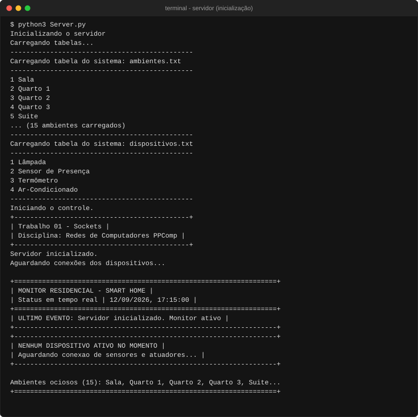
*(Arquivos de imagem:* [SVG](doc/assets/prints/print1_inicializacao_servidor.svg) | [PNG](doc/assets/prints/print1_inicializacao_servidor.png)*)*

---

### 5.3. Cenário 2: Teste Obrigatório de Erro (Dispositivo Não Suportado)

**Exigência do Trabalho:** Comprovar o que ocorre quando um dispositivo não suportado tenta se registrar na rede.

1. Um cliente socket genérico conecta e envia `MSG_REGISTRO` com código `99` (inexistente em `dispositivos.txt`).
2. O servidor valida o tipo, rejeita o registro, despacha `MSG_STATUS` com código de erro `[5] Tipo de dispositivo não suportado` e finaliza a conexão TCP graciosamente:

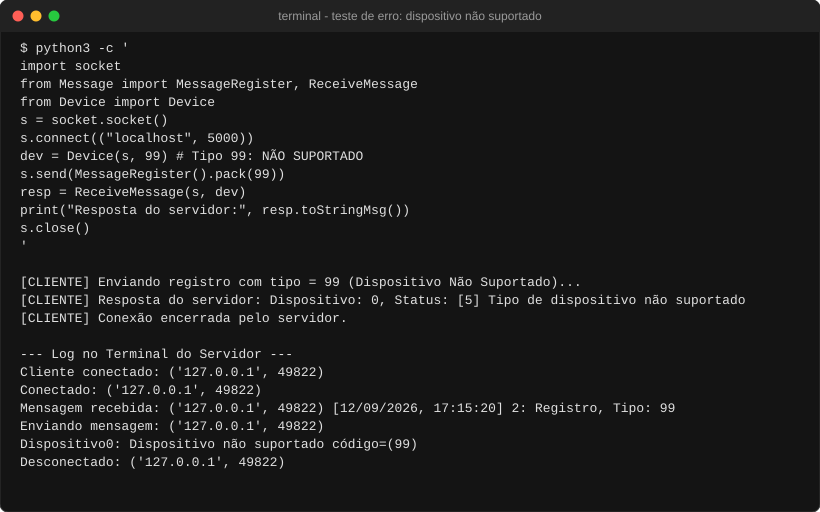
*(Arquivos de imagem:* [SVG](doc/assets/prints/print2_dispositivo_nao_suportado.svg) | [PNG](doc/assets/prints/print2_dispositivo_nao_suportado.png)*)*

---

### 5.4. Cenário 3: Registro de Dispositivos e Ambientes

Conectamos a **Lâmpada**, que consulta o catálogo, seleciona o ambiente `1` (Sala) e recebe o `ID = 1`. O Monitor desenha imediatamente o cartão dedicado da Sala:

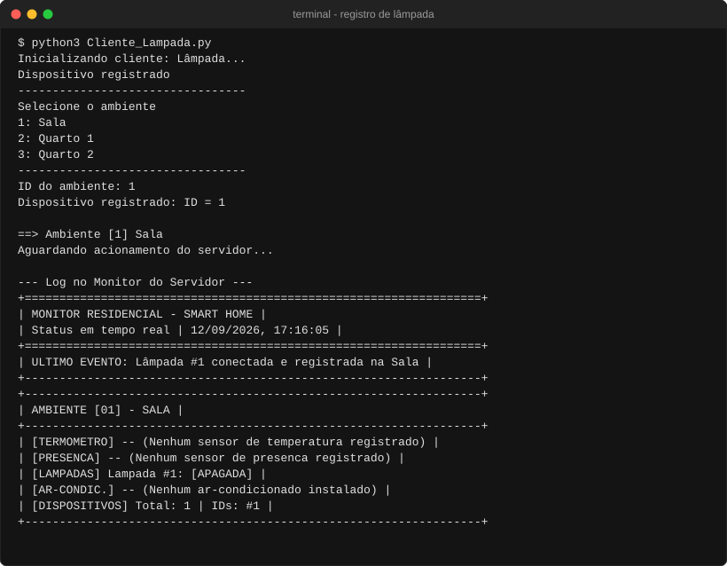
*(Arquivos de imagem:* [SVG](doc/assets/prints/print3_registro_dispositivos.svg) | [PNG](doc/assets/prints/print3_registro_dispositivos.png)*)*

---

### 5.5. Cenário 4: Atuação Integrada Presença $\rightarrow$ Lâmpada

1. Conectamos o **Sensor de Presença** no ambiente `1` (Sala), recebendo `ID = 2`.
2. No console do sensor, digitamos `1` (presença detectada).
3. O servidor repassa a ordem pela fila da lâmpada, o cliente da Lâmpada exibe `LAMPADA LIGADA` e o Monitor atualiza o indicador da sala para `[ACESA]`:

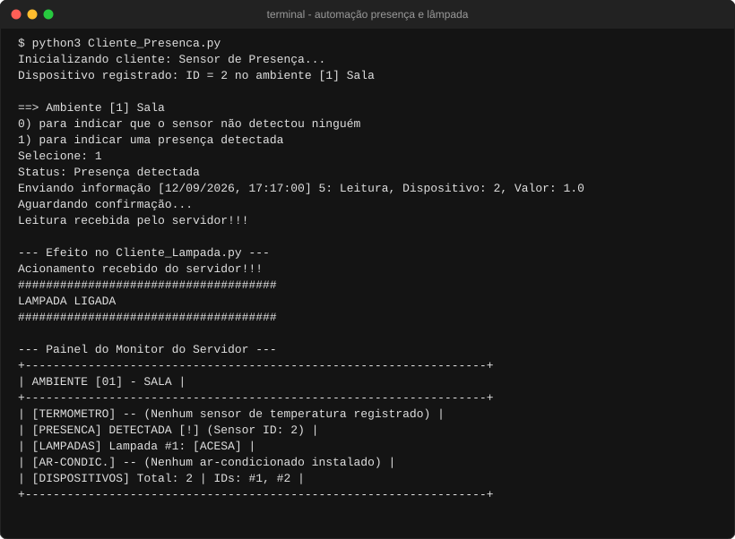
*(Arquivos de imagem:* [SVG](doc/assets/prints/print4_atuacao_presenca_lampada.svg) | [PNG](doc/assets/prints/print4_atuacao_presenca_lampada.png)*)*

---

### 5.6. Cenário 5: Automação Térmica Termômetro $\rightarrow$ Ar-Condicionado

1. Conectamos o **Termômetro** (`ID = 3`) e o **Ar-Condicionado Inteligente** (`ID = 4`) na Sala.
2. O usuário digita no termômetro a temperatura `26.5` °C ($> 24.0^\circ\text{C}$).
3. O servidor aciona a automação climática: o cliente do Ar-Condicionado recebe a ordem e imprime o display de refrigeração ativa, enquanto o Monitor atualiza o status para `[LIGADO]`:

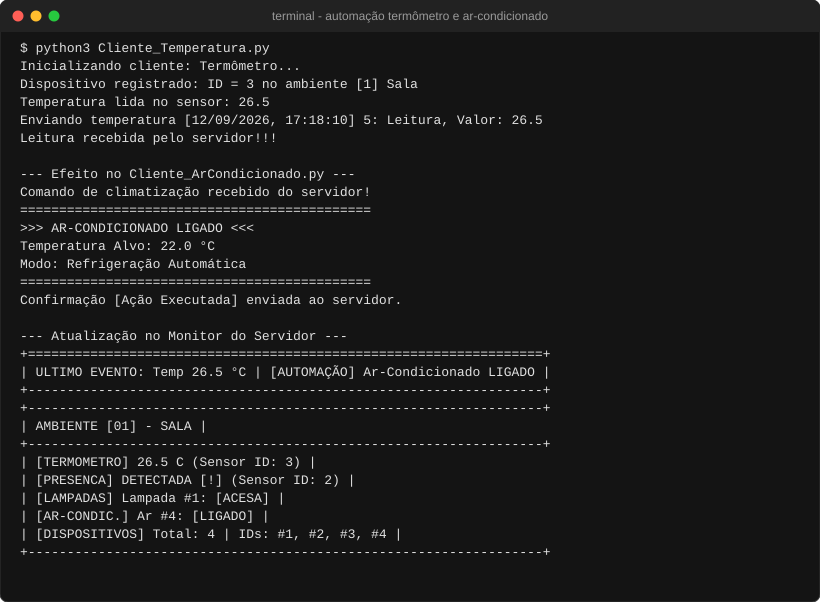
*(Arquivos de imagem:* [SVG](doc/assets/prints/print5_automacao_ar_condicionado.svg) | [PNG](doc/assets/prints/print5_automacao_ar_condicionado.png)*)*

---

### 5.7. Cenário 6: Resfriamento e Desligamento Automático

1. Conforme a temperatura cai, o usuário simula a leitura de `21.5` °C ($\le 22.0^\circ\text{C}$) no termômetro.
2. O servidor identifica o conforto térmico e despacha ordem de desligamento:
3. O cliente do Ar-Condicionado comuta para `Standby / Desligado` e o Monitor registra `[DESLIGADO]`:

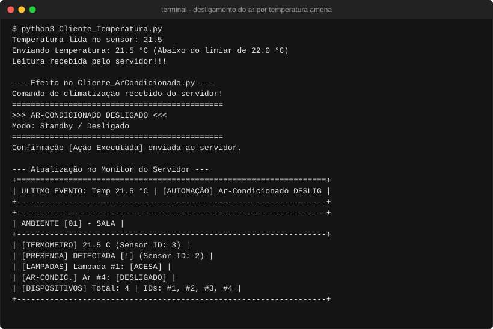
*(Arquivos de imagem:* [SVG](doc/assets/prints/print6_desligamento_ar_temperatura.svg) | [PNG](doc/assets/prints/print6_desligamento_ar_temperatura.png)*)*

---

### 5.8. Cenário 7: Visão Panorâmica Multitasking em Terminal Ultrawide (`tmux`)

Para comprovar a robustez e a escalabilidade da arquitetura concorrente sob carga distribuída em tempo real, tudo foi executado simultaneamente em uma única sessão do `tmux`:
* **Painel 1 (Superior Esquerdo)**: Servidor Central com `Monitor.py` em tempo real, gerenciando múltiplos cômodos ativos (`Sala` e `Suíte`).
* **Painéis 2 a 8**: 7 clientes conectados simultaneamente:
  * 1 × Sensor de Presença (`Sala`)
  * 1 × Lâmpada Inteligente (`Sala`)
  * 2 × Ar-Condicionado Inteligente (`Sala` e `Suíte`)
  * 2 × Termômetros Inteligentes (`Sala` e `Suíte`)

<p align="center">
  <a href="doc/assets/prints/print7_teste_no_tmux.png" target="_blank" title="Clique para abrir e inspecionar em alta resolução (3398 × 1387)">
    
  </a>
  <br>
  <sub>🔍 <b>Opções de visualização:</b> <a href="doc/assets/prints/print7_teste_no_tmux.png" target="_blank"><b>[ Abrir em Tela Cheia (3398 × 1387) ]</b></a> &nbsp;|&nbsp; <a href="doc/assets/prints/print7_teste_no_tmux.png" download="print7_teste_no_tmux.png"><b>[ Baixar Imagem Original ]</b></a></sub>
</p>

---

## 6. Conclusão e Resultados Obtidos

O projeto promoveu uma gama de objetivos:
* **Domínio Teórico e Didático**: Aprofundamento dos conceitos de socket streaming, buffer TCP e framing de pacotes.
* **É sabido que aprender fazendo (mão na massa) fixa melhor o conteúdo**
* **Diagramas Aprimorados**: A evolução visual os fluxogramas legados em diagramas modernos Mermaid com exportação SVG e PNG é um benefício para a caixa de ferramentas do programador de redes.
* **Extensão do Sistema**: Implementação de ponta a ponta de um Ar-Condicionado Inteligente e integração com o Termômetro.
* **Qualidade de Software**: Identificação e resolução de bugs de digitação, atributos inexistentes, strings e concorrência multithread.
* **Experiência Pessoal**: Para um programador Web que sempre passou dados de uma lado para o outro na rede e nunca fez uma linha usando sockets, passei a dar mais valor ao os frameworks.
